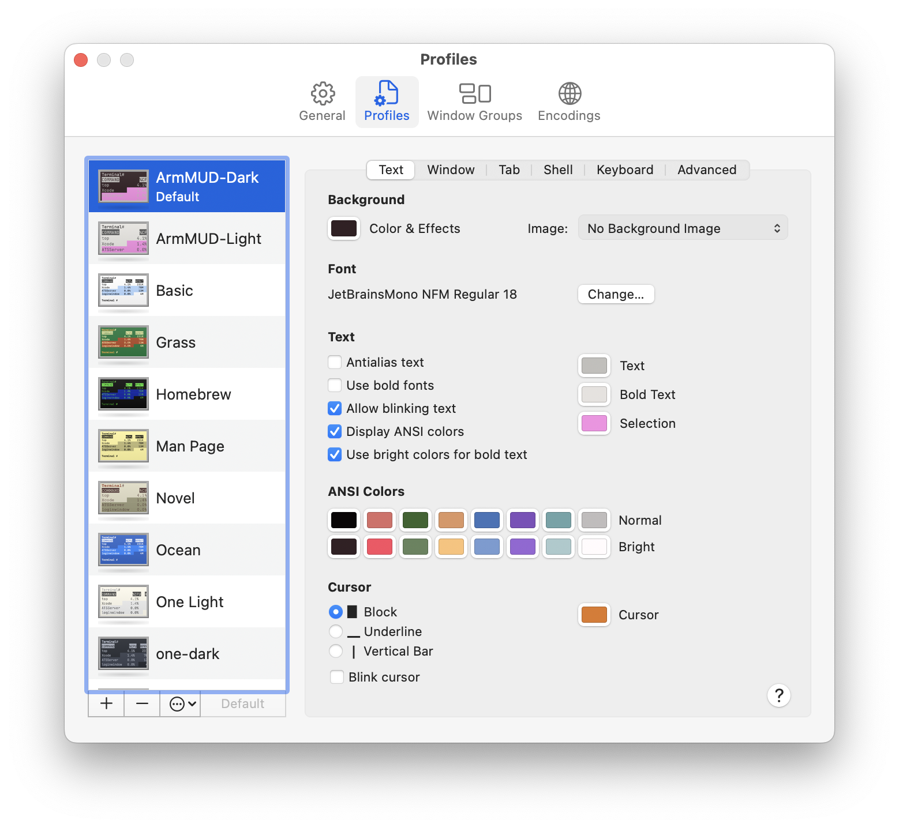
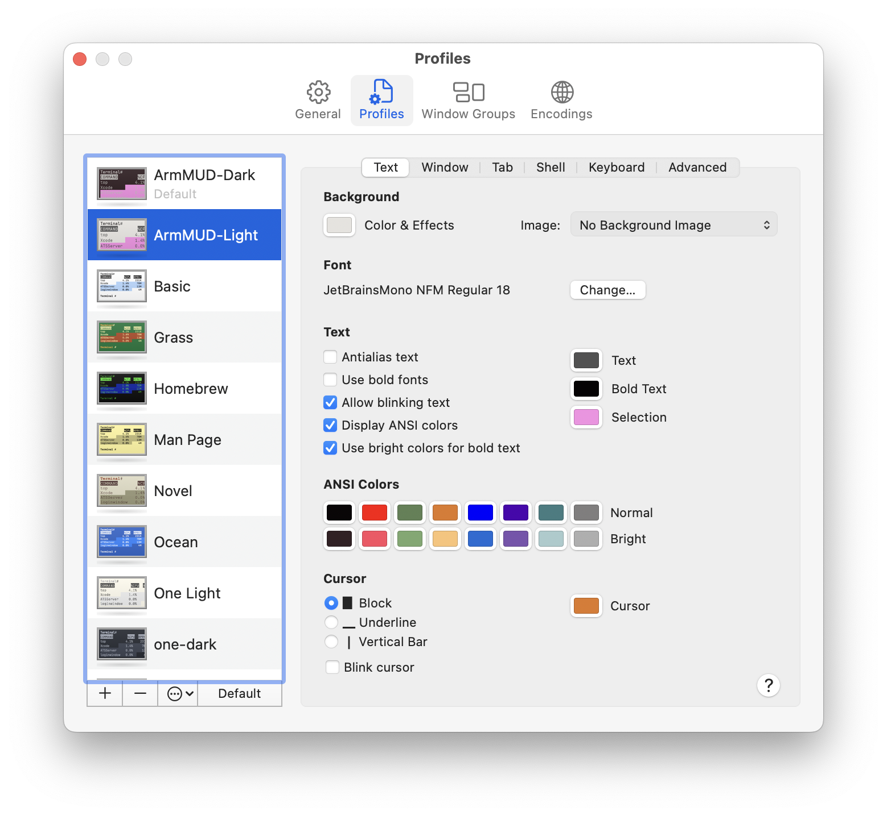
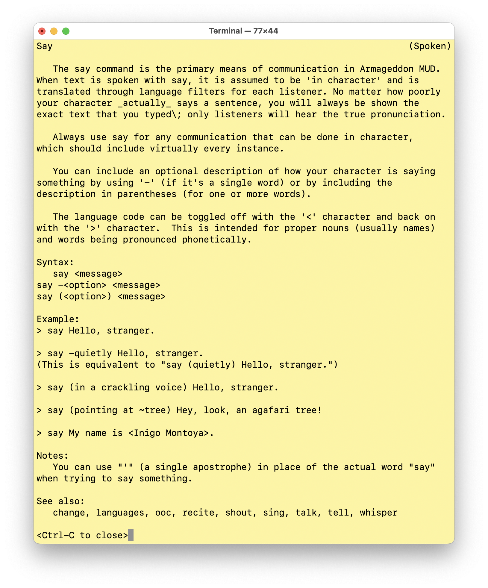
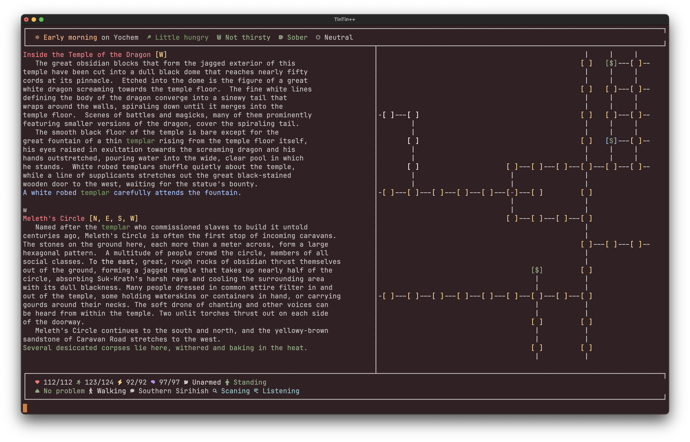
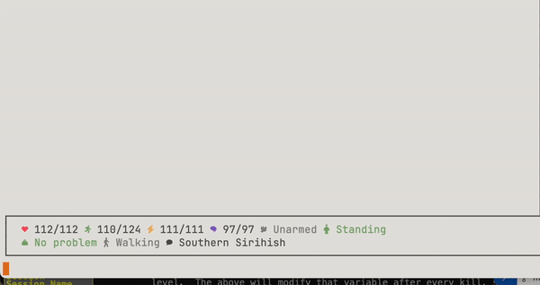

# Armageddon MUD TinTin++ Scripts
Disclaimer: These may not work on Windows yet, I'll put some time into making them more cross platform eventually. In the meantime feel free to make a pull request :)

## Table of Contents

- [Prerequisites](#prerequisites)
- [Configuration](#configuration)
- [Play](#play)
- [Screenshots](#screenshots)
- [Mapping](#mapping)
- [Credits](#credits)

## Prerequisites (required)

### Get TinTin++
https://tintin.mudhalla.net

These are TinTin++ scripts (.tin) They will not work with any other MUD/MUSH client.

### Install a NerdFont
https://www.nerdfonts.com

If you're not familiar with NerdFonts, they are font files that include myriad icons as characters.

Without a NerdFont your prompts will look messed up. 

There are a variety to choose from, I personally use _JetBrainsMono Nerd Font_.

### Install these scripts

Using git:
`git clone git@github.com:strnglp/armageddon.git ~/Armageddon` 

Downloading a release zip:

On the right side of this github repository page you should see the latest **Releases**.

Download and exract `Sources.zip` to `$HOME/Armageddon`

## Configuration
### NerdFont (required)
Change your terminal emulator's default font to the NerdFont you just installed.

### Login (required)
The only essential configuration required is inside `Login.tin`. Add your username and password there, or just delete those lines if you prefer to type them at login every time.

### Infobar (required)
Once you have logged in for the first time (see [Play](#play)) type this command to setup the prompt and color settings these scripts require.
`InstallInfobar`

### Optional configuration

#### Mana
If you're a caster, you'll want to set `#variable {mana} {on}` in `Global.tin`.
You can toggle this on and off with `manaon` and `manaoff` in game.

#### PC Nicknames
Check out `PCs.tin` for an example of how you can highlight people you know and add nicknames.

#### Highlights
`HL.tin` is where the vast majority of specialized highlighting is done. This is probably the place you want to go to add new highlight expressions. Check out TinTin++ documentation or ask in Discord for help if you're not regex and TinTin++ savvy.

#### Colorscheme
Don't like the colors in use? Change them in your terminal settings, **not the script**!

These scripts were designed to utilize ANSI colors, here are some screenshots of where you change these colors for Terminal.app on MacOS. If you're using a different terminal emulator or operating system you probably have something like this in your preferences window.

You can look at `Global.tin` to get a general idea of how colors are organized if you wish.

_Note: TinTin++ supports vastly more colors than the 16 ANSI colors I chose to use, if you want to get creative, you can read the manual and change them to your liking._

#### External help files
Ever want to read the help for a command but don't want to spam your window?

Open a second terminal window (or tab) and run `bash ~/Armageddon/WatchHelp.sh`

Now in your game terminal window (or tab) type `ehelp <topic>`

You'll get output like this in your second window.

## Play
**In your terminal type:**
`tt++ ~/Armageddon/Arm.tin` **to play Armageddon!**

Shade and water.

## Screenshots

## Mapping
The script will create a map file for you if you don't have a `MyMap.map` in your `~/Armageddon` directory.

Mapping in TinTin++ is complex and _highly_ error prone. If you are not technically minded this will be an exercise in futility for you. In which case I recommend disabling the map.

In `Arm.tin`: 
- Delete this line: `#read {$armdir/Map.tin};`
- Edit this line: `#split 3 4 0 -85` and delete the 0 -85

_Note: I'll make this easier in the future._

## Credits
These scripts were derived from MarshalDFX's work: https://github.com/mdfx01/ArmageddonMUD/
